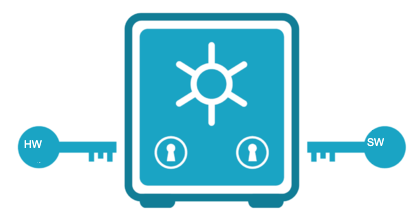

# UnruggableWallet -- ETHGlobal BANGKOK 2024


## Table of Contents

## Description


This project was developed as part of the ETHGlobal Bangkok Hackathon.
Leveraging MPC multisig signature with Account abstraction, it provides resistance against trapped or buggy hardware (which is the same) by providing a security equal to the ** weaker ** link. Compared to the safe, the multisig is computed offchain and provide only a single chain verification footprint. This provides both privacy and gas efficiency.



## What is demonstrated ?

### Problematic

A hot wallet is inspectable, but is not resilient to malwares on the host, even using Passkeys. On the other hand hardware wallet cannot disclose their full design for NDA reasons, letting a possibility to insert a potential trapdoor. Also when implementing cryptography, a bug can be leveraged to extract secrets. A way to solve this is to use multisig. Current non MPC solutions reveals information about the governance. MPC solutions are mostly ECDSA based, often crippled by attacks. This project leverage the safest algorithm, benefiting from Taproot (BTC) experience, aligning its implementation on BIP327 specs: Musig2 (Moooooooo !).


### Initial target

The user want to switch from a simple EoA to a multisig wallet, combining two different stacks/provider (hardware/software). It generates its new Musig2 public keys in each wallet, publicly aggregate them. Then a 7702 transaction is pushed to add a delegation to a contract which public key is the aggregated public key.

Now when signing, the wallet companion (Rabby/Metamask) generates one share of the signature, while the hardware wallet generates its own. The companion aggregates the signature and pushes it onchain.

## Installation

### Javascript (Signer) library

It is necessary to install noble-curves, which the library is based on for the elliptic primitives function.

`npm install @noble/curves`

Test of BIP327 can be run typing  

`node test_bip327.mjs`

The test includes the BIP327 test vectors, enforcing compatibility of the signer with BTC, and any 4337/7702 integrating the libSCL_BIP327.sol verifier.

### Contracts (On chain Verifier)

The Onchain verifier is the smartContract libSCL_BIP327.sol. 


#### Deploy the stack on networks 

```bash
forge script tbd.s.sol --private-key <PRIVATE_KEY> --broadcast -vvv --rpc-url <RPC_URL>
```

## Live contracts addresses

## References
- Multisignature in bitcoin : https://bitcoinwiki.org/wiki/multisignature
- Musig2 : https://eprint.iacr.org/2020/1261

## Code ownership

License is MIT, which allow any use as long as citation and headers are provided

-  smoo.th  cryptographic library has been forked : https://github.com/get-smooth/crypto-lib.
- The bip327.mjs module is heavily inspired from BIP327 python material, but using the more secure noble-curves repository. Biased advice: you shall always secure fund with a HW.


## Future work

Keywords: Unruggable wallet, EIP7702, MPC, Musig2, Schnorr, BIP327.
