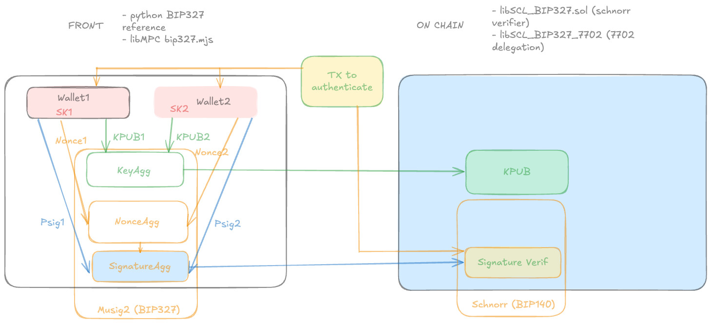

# UnruggableWallet -- ETHGlobal BANGKOK 2024


<div align="center">

</div>

_<p align="center"> - MOO!, I said MOO(sig)_

## Table of Contents

## Description


This project was developed as part of the ETHGlobal Bangkok Hackathon.
Leveraging MPC multisig signature **Musig2** (MOO!) with Account abstraction, it provides resistance against trapped or buggy hardware (which is the same) by providing a security equal to the **weaker** link. Compared to the safe, the multisig is computed offchain and provide only a single chain verification footprint. This provides both privacy and gas efficiency.

<div align="center">

</div>

Keywords: Unruggable wallet, EIP7702, MPC, Musig2, Schnorr, BIP327.


## What is demonstrated ?

### Problematic

A hot wallet is inspectable, but is not resilient to malwares on the host, even using Passkeys. On the other hand hardware wallet cannot disclose their full design for NDA reasons, letting a possibility to insert a potential trapdoor. Also when implementing cryptography, a bug can be leveraged to extract secrets. A way to solve this is to use multisig. Current non MPC solutions reveals information about the governance. MPC solutions are mostly ECDSA based, often crippled by attacks. This project leverage the safest algorithm, benefiting from Taproot (BTC) experience, aligning its implementation on BIP327 specs: Musig2 (Moooooooo !).


### Initial target

The user want to switch from a simple EoA to a multisig wallet, combining two different stacks/provider (hardware/software). It generates its new Musig2 public keys in each wallet, publicly aggregate them. Then a 7702 transaction is pushed to add a delegation to a contract which public key is the aggregated public key.

Now when signing, the wallet companion (Rabby/Metamask) generates one share of the signature, while the hardware wallet generates its own. The companion aggregates the signature and pushes it onchain.

## Installation

### Javascript (Signer) library

It is necessary to install noble-curves, which the library is based on for the elliptic primitives function.

`npm install @noble/curves`

Test of BIP327 can be run typing  

`node test_bip327.mjs`

The test includes the BIP327 test vectors, enforcing compatibility of the signer with BTC, and any 4337/7702 integrating the libSCL_BIP327.sol verifier.

### Contracts (On chain Verifier)

The Onchain verifier is the smartContract libSCL_BIP327.sol. To ensure interoperability and security, the verifier is compliant with 
[BIP 327](https://github.com/bitcoin/bips/blob/master/bip-0327.mediawiki), only that it takes a decompressed key in raw format (2x32 bytes).

```
//A schnorr verifier compatible with BIP327
//compared to BIP327, which takes only pubkeyX as input, it is assumed that public key has been decompressed using ecDecompress_BTC
//this avoid to perform the same decompression at every verification
  function Schnorr_verify(bytes memory message, uint256 pubkeyX, uint256 pubkeyY, uint256 r, uint256 s)
```

#### Deploy the stack on networks 

```bash
forge script tbd.s.sol --private-key <PRIVATE_KEY> --broadcast -vvv --rpc-url <RPC_URL>
```


## References
- Multisignature in bitcoin : https://bitcoinwiki.org/wiki/multisignature
- Musig2 : https://eprint.iacr.org/2020/1261


## Description of Musig2 primitives

A 2 of 2 session is described here. It generalizes identically with larger user set.
We use BIP327 with no tweak.


### Key generation and aggregation

First, user1 and user2 generates their private key, or import them from seed. 
```
    const sk1=secp256k1.utils.randomPrivateKey();//this provides a 32 bytes array
    const sk2=secp256k1.utils.randomPrivateKey();
```

Corresponding aggregated key is derived from public keys:
```
 const pubK1=IndividualPubKey_array(sk1);
 const pubK2=IndividualPubKey_array(sk2);

 const pubkeys=[pubK1, pubK2];

 let aggpk = key_agg(pubkeys)[0];//here aggpk is a 33 bytes compressed public key
 let x_aggpk=aggpk.slice(1,33);//x-only version for noncegen
```
(of course in practice derivation occurs separately in each signer secure domain)


### Signature session

Assuming user generated their public key according to previous section, they now want to jointly sign a message `msg`. An example session is provided [here](https://github.com/rdubois-crypto/UnruggableWallet/blob/66b84ec4f807919dd443907463318fac0ac1b5f5/src/libMPC/test_bip327.mjs#L290). 

#### Round 1
In first round, user1 and user2 generates public and secret nonces. Public are shared, secret keep in respective secure domain.

```
    let nonce1= nonce_gen(seckeys[0], pubkeys[0], aggpk, msg, i.to_bytes(4, 'big'));
    let nonce2= nonce_gen(seckeys[1], pubkeys[1], aggpk, msg, i.to_bytes(4, 'big'));

    let aggnonce = nonce_agg(nonce1[0], nonce2[0]);
```

#### Round 2
In second round, each user computes its partial signature, which are then aggregated and broadcast on chain:

```
    const tweaks=[];
    const session_ctx=[aggnonce, pubkeys, [], [], msg];

    let p1=psign(nonce1[1], seckeys[0], session_ctx);
    let p2=psign(nonce2[1], seckeys[1], session_ctx);
    
    psigs=[p1,p2];
    
    let res=partial_sig_agg(psigs, session_context);
```
res is the final results to push onchain

## Code ownership

License is MIT, which allow any use as long as citation and headers are provided

-  smoo.th  cryptographic library has been forked : https://github.com/get-smooth/crypto-lib.
- python reference code material : https://github.com/bitcoin/bips/tree/master/bip-0327
- The bip327.mjs module is heavily inspired from above python material, adapted on top of noble-curves repository. 
- noble curve ECC in javascript : https://github.com/paulmillr/noble-curves
(Biased advice: you shall always secure fund with a HW.)
- https://github.com/paradigmxyz/forge-alphanet: example of Delegation with 7702


## Plan, achievements, remaining tasks
### Architecture

The initial plan consisted in:
- implement a schnorr verifier, compatible with the BIP140, in solidity for the onchain verification
- implement a front wallet from scratch with V0, illustrating the migration from an eoA to a delegation contract using 7702
- implement a javascript signer compliant with BIP327
- connect the whole together to enable a beginner user to switch from a single signer module to a multi-signer one.
- if remaining time, try to extract from Ledger bitcoin App the Musig2 part, to provide a software+harware wallet unruggable by Bugs/Shaddy Recovery/A trap/Any tinfoil you can imagine.




_<p align="center"> - figure: project architecture_

### Execution

#### During Hackathon
- The minimal wallet has been developped from scratch using V0
- solidity contract is validated over the python reference code, it can be checked using cast. Also note that the references vectors provided in solidity test are present in the python code.
- javascript functions have been correctly tested against reference vectors of the norm unitary. However when integrated into a whole session, the aggregation of signature shares fail.
- it is possible to emulate the protocol with python, thus not integrated in the wallet as we expected to integrate the js.

#### Post hackathon
- javascript now fully functional. A more advanced version (including multiple curves support) is available on [SCL](https://github.com/get-smooth/crypto-lib) repository.

## Warning

This is hackathon code, nonce generation is not safe, you need expertise to solve antireplay and other tricky stuffs,  do not use this in production !


## Future work

## Live contracts addresses

While the main contract storing Musig2 verification is deployed on all chains. Only Mekong enables today a delegation using 7702. A script present in /script enables to deploy in all the following networks.


- Mekong testnet
  * chainID:7078815900
  * RPC:https://rpc.mekong.ethpandaops.io
  * Deployed address:

- Arbitrum Sepolia testnet
  * chainID:421614
  * RPC:https://sepolia.arbiscan.io
  * Deployed address:
Deployer: 0x77bcB19f4B4F3c6077399ADE22C366Bf66F3Ac36
Deployed to: 0x05eFAC4C53Ec12F11f144d0a0D18Df6dfDf83409
Transaction hash: 0xfdc5aeb23b141f1d6de1ca247658566e96d89769eab62d134230710b0ef3d4ed

- Polygon Amoy
  * chainID:80002
  * RPC:https://polygon-amoy.drpc.org
  * Deployed address:0x05eFAC4C53Ec12F11f144d0a0D18Df6dfDf83409
https://www.okx.com/fr/web3/explorer/amoy/tx/0x41350b1d41af63a365feab650c3186e4fa180047ec99e976fc6205465227cfd4

- Base Sepolia testnet
  * chainID:84532
  * RPC:wss://base-sepolia-rpc.publicnode.com
  * Deployed address:0x05eFAC4C53Ec12F11f144d0a0D18Df6dfDf83409
Deployer: 0x77bcB19f4B4F3c6077399ADE22C366Bf66F3Ac36
Deployed to: 0x05eFAC4C53Ec12F11f144d0a0D18Df6dfDf83409
Transaction hash: 0xca829b11b9d2483ad00ff2bd099ef42692395911c603861c78c9f57dbc31b85d

- Scroll Sepolia testnet
  * chainID:534351
  * RPC:wss://scroll-sepolia-rpc.publicnode.com
  * Deployed address:0x05eFAC4C53Ec12F11f144d0a0D18Df6dfDf83409
Deployer: 0x77bcB19f4B4F3c6077399ADE22C366Bf66F3Ac36
Deployed to: 0x05eFAC4C53Ec12F11f144d0a0D18Df6dfDf83409
Transaction hash: 0xa435e9e9f644390d0f56eedf09fe391ddf2702793e378ee1ce8455a3a2255fb4


- CELO Alfajores testnet
  * chainID:44787
  * RPC:wss://alfajores-forno.celo-testnet.org/ws
  * Deployed address:0x05eFAC4C53Ec12F11f144d0a0D18Df6dfDf83409
Deployer: 0x77bcB19f4B4F3c6077399ADE22C366Bf66F3Ac36
Deployed to: 0x05eFAC4C53Ec12F11f144d0a0D18Df6dfDf83409
Transaction hash: 0x8816dc294956dbccc123e3bbe1561266a064e0e2a291737570458fd2576aaff6

- Mantle testnet
  * chainID:5003
  * RPC:https://rpc.sepolia.mantle.xyz
  * Deployed address: no faucet provided

- Linea Sepolia
  * chainID:59141
  * RPC:wss://linea-sepolia-rpc.publicnode.com
  * Deployed address: no faucet provided